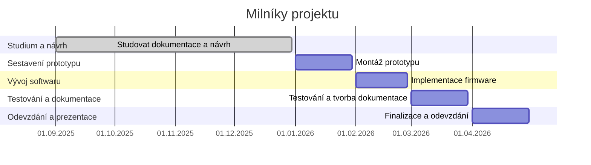

# KYB Fotaoparát - Systém pro obsluhu kamery

## Zadání projektu
Cílem práce je návrh a realizace systému pro obsluhu
digitální kamery pomocí mikrokontroléru.

## Řešitelský tým
Vít Hovorka

## Vedoucí
Jiří Švihla

## Oponent
Pavel Jedlička

## Shrnutí projektu
Projekt „Fotaoparát" má za cíl navrhnout a realizovat řídicí systém pro digitální fotoaparát založený na mikrokontroléru ESP32‑P4. Práce kombinuje návrh hardware (schemata, PCB, periferie), mechanický návrh těla a vývoj firmware pro řízení kamery, paměti a uživatelského rozhraní.
## Fáze a plnění
## Termíny
| milník                                | termín              |
| :------------------------------------ | :------------------ |
| Nastudování dokumentací, návrh zapojení a design obalu| **30.12.2025** |
| Sestavení                         | **30.1.2026**  |
| Naprogramování operačního softwaru   | **27.2. 2026** |
| Testování a tvora dokumentace        | **30.03.2026** |
| Odevzdání ročníkové práce            | **30.04.2026** |

[^1]: Změněno na základě požadavků

### Ganttův diagram postupu
